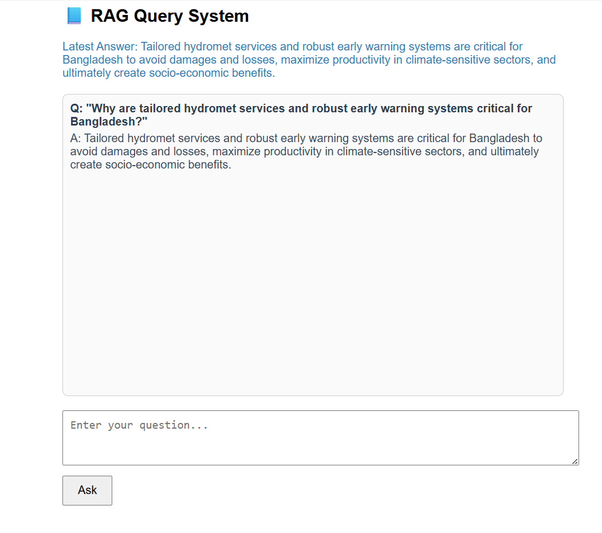

curl -X POST "http://127.0.0.1:8000/ask" -H "Content-Type: application/json" -d '{"query":"Why are tailored hydromet services and robust early warning systems critical for Bangladesh?"}'

to run fast api server

uvicorn main:app --reload

before creeaing frontend

npx clear-npx-cache

